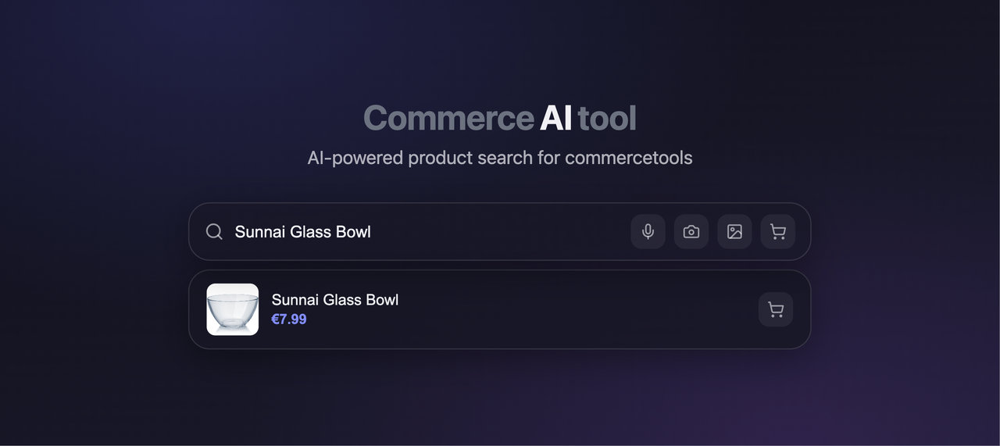

# Commerce AI Tool

AI-powered product search plugin for [commercetools](https://commercetools.com) composable commerce projects. Supports React, Next.js, and Angular with voice, text, and image search.



The browser widget talks only to your host API. API keys never reach the client.

```
Browser Widget  →  Host /api/commerce-ai/*  →  AI + ElevenLabs + commercetools
```

## Documentation

**[docs/](./docs/README.md) is the source of truth.** Start there.

| | |
|--|--|
| [Getting started](./docs/getting-started.md) | Install, routes, React / Angular / Express |
| [Configuration](./docs/configuration.md) | Locales, env vars, facets, missions |
| [Search pipeline](./docs/search-pipeline.md) | LLM interpretation and Product Search |
| [Cart and checkout](./docs/cart-and-checkout.md) | Cart, payments, orders |
| [Observability](./docs/observability.md) | `CAT_DEBUG`, Langfuse |
| [Development](./docs/development.md) | Commands, evals, publishing |
| [Roadmap](./docs/roadmap.md) | Shipped versions and current work |

## Packages

| Package | Description |
|---------|-------------|
| [`@commerce-ai-tool/core`](./packages/core) | Framework-agnostic search logic, AI adapters, commercetools client |
| [`@commerce-ai-tool/server`](./packages/server) | Server-side API handlers (Next.js App Router, Express) |
| [`@commerce-ai-tool/react`](./packages/react) | Glass morphism search widget for React / Next.js |
| [`@commerce-ai-tool/angular`](./packages/angular) | Standalone Angular search component |

## Features

- **Text search** — natural language queries interpreted by AI (OpenRouter or AWS Bedrock)
- **Autocomplete** — Search Term Suggestions, with AI catalog-language phrases when needed
- **Voice search** — ElevenLabs STT with optional TTS result summary
- **Image search** — vision AI extracts product attributes from photos
- **Glass UI** — light / dark / auto theme; widget labels overridable via `messages`
- **Cart and checkout** — optional add-to-cart, host-owned checkout, payments, orders
- **Shopping missions** — opt-in compound lists split into parallel Product Search calls
- **Server-only secrets** — API keys never exposed to the browser

## Quick start

```bash
pnpm add @commerce-ai-tool/react @commerce-ai-tool/server
```

Copy [`apps/demo-next/.env.example`](./apps/demo-next/.env.example), enable [Product Search](https://docs.commercetools.com/api/projects/product-search) on the commercetools project, then follow [Getting started](./docs/getting-started.md).

Local demo:

```bash
pnpm install
pnpm build
pnpm dev   # http://localhost:3000
```

## License

MIT
