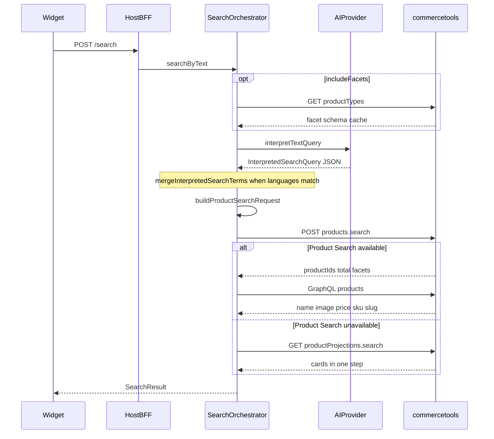
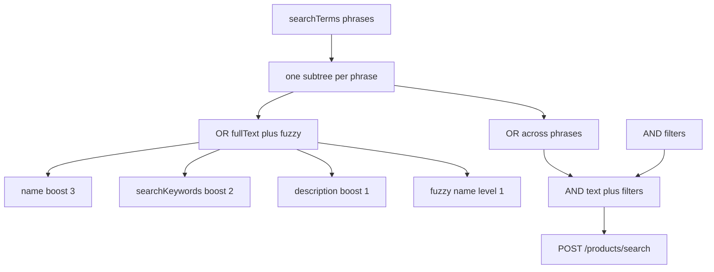
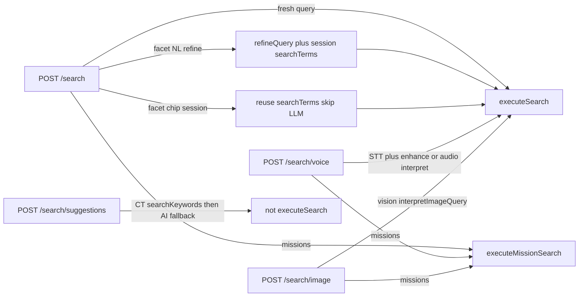
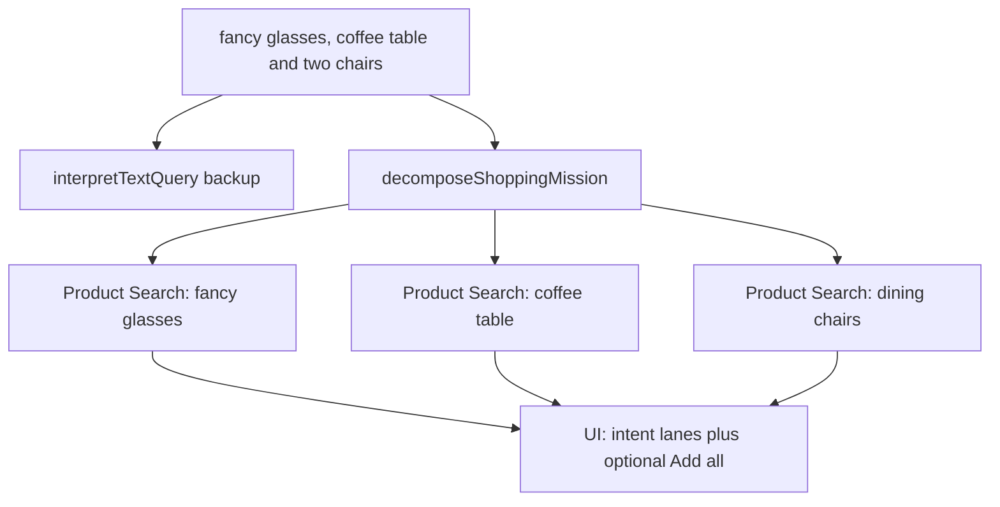

# Search pipeline

How a shopper query travels from the frontend widget to commercetools Product Search. The LLM never emits a commercetools request body: it returns a typed intermediate contract, and a deterministic builder turns that into the API call.

[Documentation index](README.md) · [Configuration](configuration.md) · [Observability](observability.md)

## Trust boundary

The browser never talks to commercetools, OpenRouter/Bedrock, or ElevenLabs. The widget calls only the host BFF.

```
Browser widget  →  Host /api/commerce-ai/*  →  @commerce-ai-tool/server  →  @commerce-ai-tool/core
                                                                              ├─ AI provider
                                                                              └─ commercetools
```

| Layer | Package | Role |
|-------|---------|------|
| Widget | `@commerce-ai-tool/react` or `@commerce-ai-tool/angular` | Collect query, locales, and flags; render cards |
| BFF | Host app using `@commerce-ai-tool/server` | Next.js / Express handlers; keep secrets server-side |
| Orchestrator | `@commerce-ai-tool/core` | Interpret → build query → search → hydrate cards |

Primary sources:

- Widget request: `packages/react/src/hooks/useCommerceAISearch.ts`
- Route body: `packages/server/src/route-actions.ts`
- Pipeline: `packages/core/src/search/orchestrator.ts`
- Query builder: `packages/core/src/commercetools/query-builder.ts`

## Locales

Search uses two locales. Mixing them up is the usual source of empty results.

| Field | Purpose | Source |
|-------|---------|--------|
| `queryLocale` | Language the shopper types or speaks. Used as LLM input language and for `interpretation` / TTS. | Widget prop or request body; defaults to `catalogLocale` |
| `catalogLocale` | Language products are indexed in. Used for `fullText.language`, card names, and `searchTerms`. | `CAT_CATALOG_LOCALE` or widget prop |

The model **translates** product keywords into the catalog language. Raw user text is not sent to Product Search except for the same-language passthrough described below.

Resolver: `packages/core/src/locale/resolve.ts`. Env vars and seeding: [configuration](configuration.md).

## Text search (happy path)

Fresh `POST /search` with `{ query, queryLocale, catalogLocale, includeFacets?, enableMissions? }`.



Timeouts (defaults): AI text 15s, commercetools 8s. Optional in-process response cache is keyed on query + locales + limit.

## LLM interpretation

Prompt name: `commerce-ai/text-query` (`packages/core/src/prompts/index.ts`). Git is the source of truth; Langfuse can serve the same system text at runtime.

The user message includes:

1. `User query language` and `Product catalog language`
2. Optional filterable attribute catalog (from Product Types marked `isSearchable`)
3. The raw `Query: …`

The model must return JSON only (`InterpretedSearchQuery`):

```json
{
  "searchTerms": ["complete phrase in catalog language"],
  "filters": {
    "color": "optional",
    "brand": "optional",
    "category": "optional id or key",
    "priceMin": "50",
    "priceMax": "200"
  },
  "suggestedFacets": [{ "name": "color", "reason": "shopper mentioned appearance" }],
  "sort": "relevance",
  "interpretation": "brief explanation in queryLocale"
}
```

Rules encoded in the prompt and parser:

- Each `searchTerms` element is a **complete phrase**, never split words. `"red shoes"` → `["røde sko"]` for a Norwegian catalog, not `["red","shoes"]`.
- Specific product, brand, or named item → **one phrase**. Broad need (something to drink from) → **3–5 synonym or hyponym phrases** so Product Search can OR them (`glasses` *or* `mugs` *or* `cups`).
- Parser keeps at most **6** unique phrases (`MAX_INTERPRETED_SEARCH_TERMS`).
- Off-topic queries (general knowledge, jailbreaks) → `searchTerms: []` and a refusal in `interpretation`. The orchestrator then skips commercetools (`hasSearchableContent`).
- Structured constraints go in `filters`, using only attributes from the supplied catalog plus system keys (`category`, `priceMin` / `priceMax`). Dynamic attributes also support `attributeNameMin` / `attributeNameMax` ranges.

The LLM does **not** build the Product Search JSON. `parseInterpretedQuery` validates the contract; `buildProductSearchRequest` is deterministic and unit-tested.

### Typed-query passthrough

`packages/core/src/search/query-passthrough.ts` (`mergeInterpretedSearchTerms`):

- Runs only when `queryLocale` and `catalogLocale` share a language (e.g. `en` and `en-GB`).
- The typed text must look like a short product query (not a question, not off-topic prefixes such as “explain…”).
- If the model returned phrases, the typed wording is **prepended** and OR’d with them.
- If the model returned an empty `searchTerms` array for a product-like query, the typed wording is used so a short catalog-language type query still hits the index.
- A Polish query against an English catalog is **not** injected into the index — only the translated `searchTerms` are searched.

## Product Search query construction

For each catalog phrase the builder emits an **OR** of:

| Clause | Field | Notes |
|--------|-------|--------|
| `fullText` | `name` | `mustMatch: all`, boost **3** |
| `fullText` | `searchKeywords` | boost **2** |
| `fullText` | `description` | boost **1** |
| `fuzzy` | `name` | `level: 1`, `mustMatch: all` (on by default) |

Multiple phrases are OR’d. Filters are AND’d with the text query.



Example: query `red shoes`, `catalogLocale=no` → `searchTerms: ["røde sko"]` (no passthrough, languages differ):

```json
{
  "limit": 20,
  "offset": 0,
  "query": {
    "or": [
      {
        "fullText": {
          "field": "name",
          "language": "no",
          "value": "røde sko",
          "mustMatch": "all",
          "boost": 3
        }
      },
      {
        "fullText": {
          "field": "searchKeywords",
          "language": "no",
          "value": "røde sko",
          "mustMatch": "all",
          "boost": 2
        }
      },
      {
        "fullText": {
          "field": "description",
          "language": "no",
          "value": "røde sko",
          "mustMatch": "all",
          "boost": 1
        }
      },
      {
        "fuzzy": {
          "field": "name",
          "language": "no",
          "value": "røde sko",
          "level": 1,
          "mustMatch": "all"
        }
      }
    ]
  }
}
```

Filters (AND):

- Exact match on schema attributes (`color`, `brand`, or any facet attribute).
- `categories` exact when `filters.category` is set.
- Price range on `variants.prices.centAmount` (parsed as major units × 100) plus `currencyCode` when a range is present.
- Number attributes via `heightMin` / `heightMax` style keys when the facet schema marks them as `number`.
- Sort `price_asc` / `price_desc` is currency-scoped.

`storeKey` exists on the builder but is **not applied** (`storeScopeEnabled: false`).

Enable [Product Search](https://docs.commercetools.com/api/projects/product-search) on the project. If that API is unavailable, the client falls back to Product Projection Search with a single `text.{catalogLocale}` value — **only the first phrase**. Multi-phrase OR works only on Product Search.

## Search vs hydrate

Product Search returns **IDs, total, and facets**, not card fields. The orchestrator then hydrates cards with a narrow GraphQL `products` query (`name`, image, price, sku, slug) in `catalogLocale`. GraphQL hard failure falls back to REST `productProjections().get()`.

Projection Search fallback returns projections in one step, so hydrate is skipped.

## Other entry points

All of these reuse `executeSearch` except autocomplete.



**Facet refine.** After the first search, the widget keeps `searchTerms` in session. A chip click resubmits those terms plus `filters` and skips interpretation. Natural-language refine (`“height above 10 cm”`) calls `interpretRefineQuery` with the current terms, filters, and attribute catalog. When `enableMissions` is on, Enter runs a **fresh search** if the query looks like a compound shopping list (`and`, comma, `plus`); otherwise a facet session still refines (for example “taller glasses”). Facet chips still refine.

**Shopping missions** (opt-in `enableMissions`). A fresh text search runs `interpretTextQuery` and `decomposeShoppingMission` in parallel. Voice and image search run `decomposeShoppingMission` after the transcript or vision interpretation. If the mission is usable (confidence, at least two intents), each intent runs its own bounded Product Search; otherwise the standard result is used. Angular mission UI is not on this path yet. See the [worked example](#worked-example-compound-shopping-list).

**Voice.** Default OpenRouter path: one `interpretVoiceAudio` call (transcript + `searchTerms`). ElevenLabs path: STT → `enhanceVoiceTranscript` → `interpretTextQuery`. With missions on, the transcript/enhanced query then follows the same mission fan-out as text search. Spoken summaries (`enableTts`) are voice-search only.

**Image.** Vision model returns the same `InterpretedSearchQuery` contract; `searchTerms` still use catalog language. With missions on, the interpretation can fan out into intent searches the same way as text.

**Autocomplete** (`POST /search/suggestions`). commercetools Search Term Suggestions on `searchKeywords` first (full prefix, then last-token retry kept only when every query token is still present). If nothing remains for a cross-locale or multi-word natural-language prefix, a lightweight `suggestSearchTerms` call proposes catalog-language phrases. This path does not run Product Search.

## Worked example: compound shopping list

Query:

> I need some fancy glasses, coffee table and two chairs into my living room

This is several product types in one sentence, not a single SKU. Exact LLM wording is not deterministic; the pipeline and query shape are.

Typed-query passthrough does **not** apply: the sentence is too long / too many words (`isLikelyProductQuery`). The full living-room sentence is never injected into Product Search.

### With missions (`enableMissions`)

The demo widget sets `enableMissions`. For **text**, the orchestrator calls both models in parallel:

1. `interpretTextQuery` — backup if the mission is unused
2. `decomposeShoppingMission` (`commerce-ai/mission-query`) — split into product intents

Spoken and image queries reuse step 2 after transcript or vision interpretation. A mission is used when `isMission` is true, `confidence` is at least `minConfidence` (default `0.6`), and there are **two or more** intents. This query matches that pattern (same idea as “a tennis racket, two golf balls and a bag” in the mission prompt).

Illustrative `DecomposedShoppingMission` for `catalogLocale=en-GB`:

```json
{
  "isMission": true,
  "confidence": 0.9,
  "intents": [
    {
      "id": "intent-0",
      "label": "glasses",
      "quantity": 1,
      "searchTerms": ["fancy glasses", "wine glasses"]
    },
    {
      "id": "intent-1",
      "label": "coffee table",
      "quantity": 1,
      "searchTerms": ["coffee table"]
    },
    {
      "id": "intent-2",
      "label": "chairs",
      "quantity": 2,
      "searchTerms": ["dining chairs", "living room chairs"]
    }
  ],
  "interpretation": "Glasses, a coffee table, and two chairs for the living room."
}
```

Then **three independent** Product Search calls run in `Promise.all` (`perIntentLimit` defaults to 4 cards each). Glasses are not OR’d with chairs in one ranking.



Each intent uses the same builder as a normal search (OR of `name` / `searchKeywords` / `description` plus fuzzy `name`). Mission `executeSearch` does **not** pass the original sentence as `originalQuery`.

Details:

- **`quantity: 2` on chairs** is a lane hint (“Looking for 2”). Per-card add and “Add all” both use quantity 1. Search still returns up to `perIntentLimit` cards.
- **“living room”** is context, not a fourth product. It may appear inside a chair phrase (`living room chairs`).
- **“fancy”** usually stays on the glasses phrase. There is no generic `fancy` filter unless a Product Type attribute matches.
- If every intent returns zero products, the orchestrator **falls back** to the standard `interpretTextQuery` result.
- Mission mode **skips facet chips**.
- A Norwegian catalog would get Norwegian phrases (`glass`, `sofabord`, `stoler`) even though the shopper wrote English.

### Without missions (single Product Search)

One `interpretTextQuery` call. The text prompt treats a broad need as **3–5 catalog phrases in one `searchTerms` array**. Those phrases go to **one** Product Search as OR:

```json
{
  "searchTerms": ["fancy glasses", "coffee table", "dining chairs"],
  "filters": {},
  "sort": "relevance",
  "interpretation": "Looking for glasses, a coffee table, and chairs."
}
```

commercetools then ranks glasses *or* coffee tables *or* chairs in a **single flat list**. There are no intent groups and no `quantity: 2`. That mixed ranking is why missions exist.

## Debugging

See [observability](observability.md) for `CAT_DEBUG` and Langfuse. Search responses may include `meta.traceId`, `meta.queryInterpretation`, `meta.searchTerms`, and `meta.appliedFilters` for local linking (not a stable public contract).
